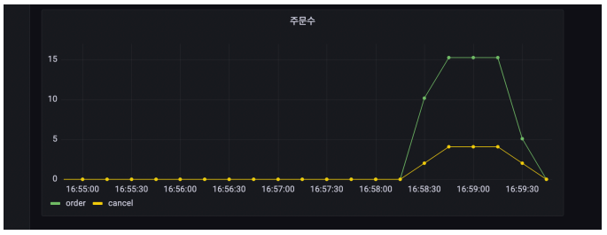

# 메트릭 등록1 - 카운터
마이크로미터를 사용해서 메트릭을 직접 등록하는 방법을 알아보자. 먼저 주문수, 취소수를 대상으로 카운터 메트릭을 등록해보자.

<br>

## MeterRegistry
마이크로미터 기능을 제공하는 핵심 컴포넌트<br>
스프링을 통해서 주입 받아서 사용하고, 이곳을 통해서 카운터, 게이지 등을 등록한다.

<br>

## Counter(카운터)
* https://prometheus.io/docs/concepts/metric_types/#counter
* 단조롭게 증가하는 단일 누적 측정항목
  * 단일 값
  * 보통 하나씩 증가
  * 누적이므로 전체 값을 포함(total)
  * 프로메테우스에서는 일반적으로 카운터의 이름 마지막에 ```_total``` 을 붙여서 ```my_order_total``` 과 같이 표현함
* 값을 증가하거나 0으로 초기화 하는 것만 가능
* 마이크로미터에서 값을 감소하는 기능도 지원하지만, 목적에 맞지 않음
* 예) HTTP 요청수

주문수 취소수 서비스에 카운터 메트릭을 적용해보자.

> 예제 코드<br>
> ```thespeace/order/V1/OrderServiceV1.java```<br>
> ```thespeace/order/V1/OrderConfigV1.java```

<br>

### 실행
* http://localhost:8080/order
* http://localhost:8080/cancel

<br>

### 액츄에이터 매트릭 확인
http://localhost:8080/actuator/metrics/my.order <br>
최소 한번은 호출을 해줘야 매트릭이 나온다.
```json
{
  "name": "my.order",
  "description": "order",
  "measurements": [
    {
      "statistic": "COUNT",
      "value": 2
    }
  ],
  "availableTags": [
    {
      "tag": "method",
      "values": [
        "cancel",
        "order"
      ]
    },
    {
      "tag": "class",
      "values": [
        "thespeace.order.v1.OrderServiceV1"
      ]
    }
  ]
}
```
* 메트릭을 확인해보면 ```method``` 로 구분할 수 있다.

<br>

### 프로메테우스 포멧 메트릭 확인
http://localhost:8080/actuator/prometheus
```
# HELP my_order_total order
# TYPE my_order_total counter
my_order_total{class="thespeace.order.v1.OrderServiceV1",method="order",} 1.0
my_order_total{class="thespeace.order.v1.OrderServiceV1",method="cancel",} 1.0
```
* 메트릭 이름이 ```my.order``` -> ```my_order_total``` 로 변경된 것을 확인할 수 있다.
  * 프로메테우스는 ```.``` -> ```_``` 로 변경한다.
  * 카운터는 마지막에 ```_total``` 을 붙인다. 프로메테우스는 관례상 카운터 이름의 끝에 ```_total``` 을 붙인다.
  * ```method``` 라는 ```tag``` , 레이블을 기준으로 데이터가 분류되어 있다.

---

<br>

## 그라파나 등록 - 주문수, 취소수
앞서 만들어둔 ```hello-dashboard``` 에 주문수, 취소수 그래프를 추가하자

<br>

### Panel options
* ```Title``` : 주문수

<br>

### PromQL
* ```increase(my_order_total{method="order"}[1m])```
  * ```Legend : {{method}}```
* ```increase(my_order_total{method="cancel"}[1m])```
  * ```Legend : {{method}}```

참고: 카운터는 계속 증가하기 때문에 특정 시간에 얼마나 증가했는지 확인하려면 ```increase()``` , ```rate()``` 같은 함수와 함께 사용하는 것이 좋다.

