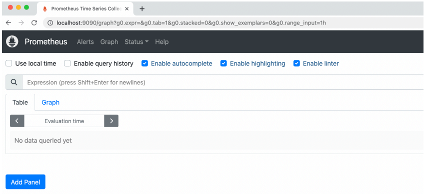

# 프로메테우스 - 설치
* https://prometheus.io/download/
* 본인에게 맞는 OS를 선택한다. 참고로 Mac OS 사용자는 ```darwin```을 선택하면 된다.

<br>

### 다운로드 - 윈도우 사용자 - ```windows-amd64``` 를 선택하면 된다.
https://github.com/prometheus/prometheus/releases/download/v2.42.0/prometheus-2.42.0.windows-amd64.zip

<br>

### 다운로드 - MAC 사용자 - ```darwin-amd64``` 를 선택하면 된다.
https://github.com/prometheus/prometheus/releases/download/v2.42.0/prometheus-2.42.0.darwin-amd64.tar.gz

<br>

### 실행 - 윈도우
```prometheus.exe``` 실행

<br>

### 실행 - MAC
```./prometheus```

<br>

### 실행
http://localhost:9090

<br>



### 해당 화면이 뜨면 성공!