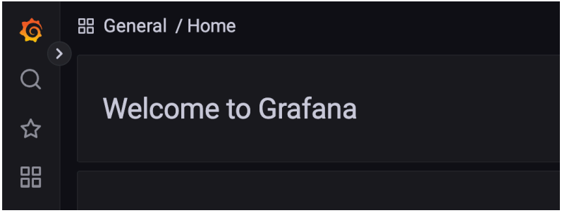

# 그라파나 - 설치
* https://grafana.com/grafana/download
* 본인에게 맞는 OS를 선택해서 다운로드 한다.

<br>

### 다운로드 - 윈도우 사용자
https://dl.grafana.com/enterprise/release/grafana-enterprise-9.3.6.windows-amd64.zip

<br>

### 다운로드 - MAC 사용자
https://dl.grafana.com/enterprise/release/grafana-enterprise-9.3.6.darwin-amd64.tar.gz

<br>


### 실행 - 윈도우
압축을 푼 곳에서 ```bin``` 폴더로 이동<br>
```grafana-server.exe``` 실행

<br>

### 실행 - MAC
압축을 푼 곳에서 ```bin``` 폴더로 이동<br>
```./grafana-server```

별 반응이 없어도 웹 브라우저를 열어서 http://localhost:3000 에 접속하자.

<br>

### 실행
* http://localhost:3000
* email or username: admin 
* Password: admin

**그 다음에 Skip을 선택하면 된다.**

다음과 같은 화면이 나오면 설치 성공이다.

