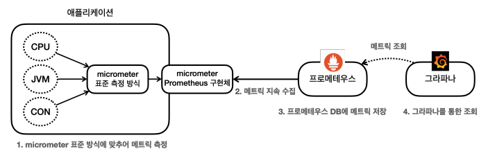
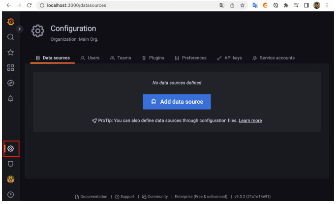
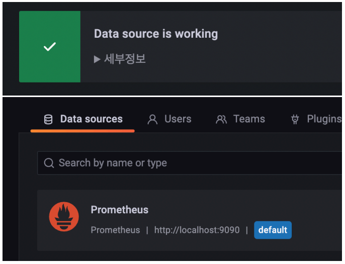

# 그라파나 - 연동
그라파나는 프로메테우스를 통해서 데이터를 조회하고 보여주는 역할을 한다. 쉽게 이야기해서 그라파나는 대시보드의 껍데기 역할을 한다.



먼저 그라파나에서 프로메테우스를 데이터소스로 사용해서 데이터를 읽어와야 한다. 이 부분을 설정해보자.<br>

### 그라파나 데이터소스 추가 화면



* 왼쪽 하단에 있는 설정(Configuration) 버튼에서 Data sources를 선택한다.
* ```Add data source``` 를 선택한다.
* Prometheus를 선택한다.

<br>

### Prometheus 데이터 소스 설정
* URL: http://localhost:9090
* 나머지는 특별히 고칠 부분이 없다면 그대로 두고 ```Save & test``` 를 선택한다.

<br>

다음을 통해 설정이 완료된 것을 확인할 수 있다.

