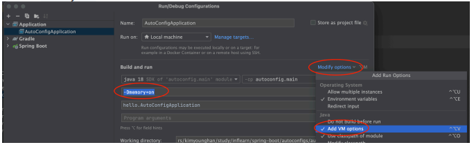

# @Conditional
* 앞서 만든 메모리 조회 기능을 항상 사용하는 것이 아니라 특정 조건일 때만 해당 기능이 활성화 되도록 해보자.
* 예를 들어서 개발 서버에서 확인 용도로만 해당 기능을 사용하고, 운영 서버에서는 해당 기능을 사용하지 않는 것이다.
* 여기서 핵심은 소스코드를 고치지 않고 이런 것이 가능해야 한다는 점이다.
  * 프로젝트를 빌드해서 나온 빌드 파일을 개발 서버에도 배포하고, 같은 파일을 운영서버에도 배포해야 한다.
* 같은 소스 코드인데 특정 상황일 때만 특정 빈들을 등록해서 사용하도록 도와주는 기능이 바로 ```@Conditional``` 이다.
* 참고로 이 기능은 스프링 부트 자동 구성에서 자주 사용한다

지금부터 ```@Conditional``` 에 대해서 자세히 알아보자. 이름 그대로 특정 조건을 만족하는가 하지 않는가를 구별하는 기능이다.

이 기능을 사용하려면 먼저 ```Condition``` 인터페이스를 구현해야 한다. 그전에 잠깐 ```Condition``` 인터페이스를 살펴보자.

<br>

### Condition
```java
package org.springframework.context.annotation;

public interface Condition {
    boolean matches(ConditionContext context, AnnotatedTypeMetadata metadata);
}
```
* ```matches()``` 메서드가 ```true``` 를 반환하면 조건에 만족해서 동작하고, ```false``` 를 반환하면 동작하지 않는다.
* ```ConditionContext``` : 스프링 컨테이너, 환경 정보등을 담고 있다.
* ```AnnotatedTypeMetadata``` : 애노테이션 메타 정보를 담고 있다.

<br>

```Condition``` 인터페이스를 구현해서 다음과 같이 자바 시스템 속성이 ```memory=on``` 이라고 되어 있을 때만 메모리 기능이 동작하도록 만들어보자.
```
#VM Options
#java -Dmemory=on -jar project.jar
```

<br>

> 예제 코드 : memory/MemoryCondition.java<br>
> 예제 코드 : thespeace/config/MemoryConfig.java

<br>

### MemoryConfig.java의 ```@Conditional(MemoryCondition.class)```
* 이제 ```MemoryConfig``` 의 적용 여부는 ```@Conditional``` 에 지정한 ```MemoryCondition``` 의 조건에 따라 달라진다.
* ```MemoryCondition``` 의 ```matches()``` 를 실행해보고 그 결과가 ```true``` 이면 ```MemoryConfig``` 는 정상 동작한다.<br>
  따라서 ```memoryController``` , ```memoryFinder``` 가 빈으로 등록된다.
* ```MemoryCondition``` 의 실행결과가 ```false``` 이면 ```MemoryConfig``` 는 무효화 된다. 그래서 ```memoryController``` , ```memoryFinder``` 빈은 등록되지 않는다.

<br>

먼저 아무 조건을 주지 않고 실행해보자.

### 실행
* http://localhost:8080/memory

### 결과
```Whitelabel Error Page```
* ```memory=on``` 을 설정하지 않았기 때문에 동작하지 않는다.

다음 로그를 통해서 ```MemoryCondition``` 조건이 실행된 부분을 확인할 수 있다. 물론 결과는 ```false``` 를 반환한다.
```memory.MemoryCondition                   : memory=null```

<br>

이번에는 ```memory=on```조건을 주고 실행해보자.


* VM 옵션을 추가하는 경우 ```Edit Configurations...``` -> ```Modify options``` -> ```Add VM options``` ->```-Dmemory=on``` 를 추가하여 사용해야 한다.

### 실행
* http://localhost:8080/memory

### 결과
```{"used":24385432,"max":8589934592}```
* ```MemoryCondition``` 조건이 ```true``` 를 반환해서 빈이 정상 등록된다.

다음 로그를 확인할 수 있다.
```
memory.MemoryCondition                       : memory=on
memory.MemoryFinder                          : init memoryFinder
```
참고: 스프링이 로딩되는 과정은 복잡해서 ```MemoryCondition``` 이 여러번 호출될 수 있다. 이 부분은 크게 중요하지 않으니 무시하자.

> 참고<br>
> 스프링은 외부 설정을 추상화해서 ```Environment``` 로 통합했다.
> 그래서 다음과 같은 다양한 외부 환경 설정을 ```Environment``` 하나로 읽어들일 수 있다. 더 자세한 내용은 나중에 알아보자.

<br>

```
#VM Options
#java -Dmemory=on -jar project.jar
-Dmemory=on

#Program arguments
# -- 가 있으면 스프링이 환경 정보로 사용
#java -jar project.jar --memory=on
--memory=on

#application.properties
#application.properties에 있으면 환경 정보로 사용
memory=on
```